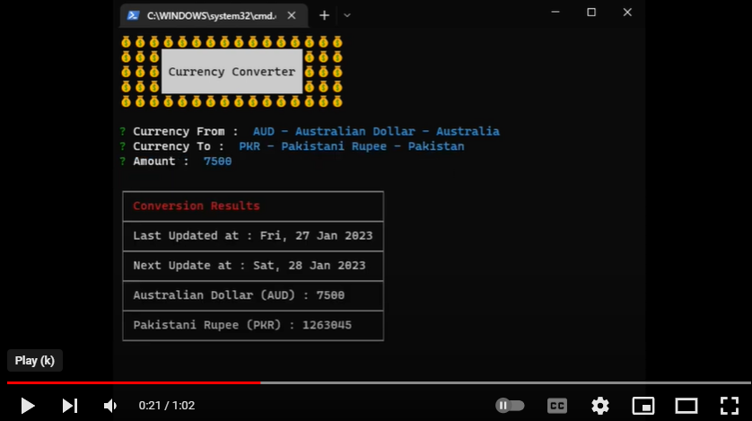

# Command Line Currency Converter (TS)

A CLI based currency converter using typescript and published as an executable npm package, complete problem statement is available [here](https://github.com/panaverse/typescript-node-projects/tree/main/project04_currency_converter).

## NPM Package

### Usage

This project is published as an [npm package](https://www.npmjs.com/package/wmd-ts-currency-converter). To use follow these steps.

- Install as an npm package

  ```cmd
  npm i wmd-ts-currency-converter
  ```

- Run the app after installation

  ```cmd
  wmd-ts-currency-converter
  ```

- Use the app as an npx package

  ```cmd
  npx wmd-ts-currency-converter
  ```

### Instructions

This app provide exchange rate for the given pair of currencies
Exchange rates are refreshed every 24 hours

- Inputs :

  - Select currency pair you want to find exchange rate of
  - Enter amount

- Results :
  - Latest exchange rate

## Demo

[](https://youtu.be/I4Bc8bZMQLE 'CLI Currency Converter')

## Steps to code CLI Currency Converter

All the details to code this app is given [here](https://github.com/hassan-ak/wmd-ts-currency-converter/tree/main/stepsToCode/Readme.md).
